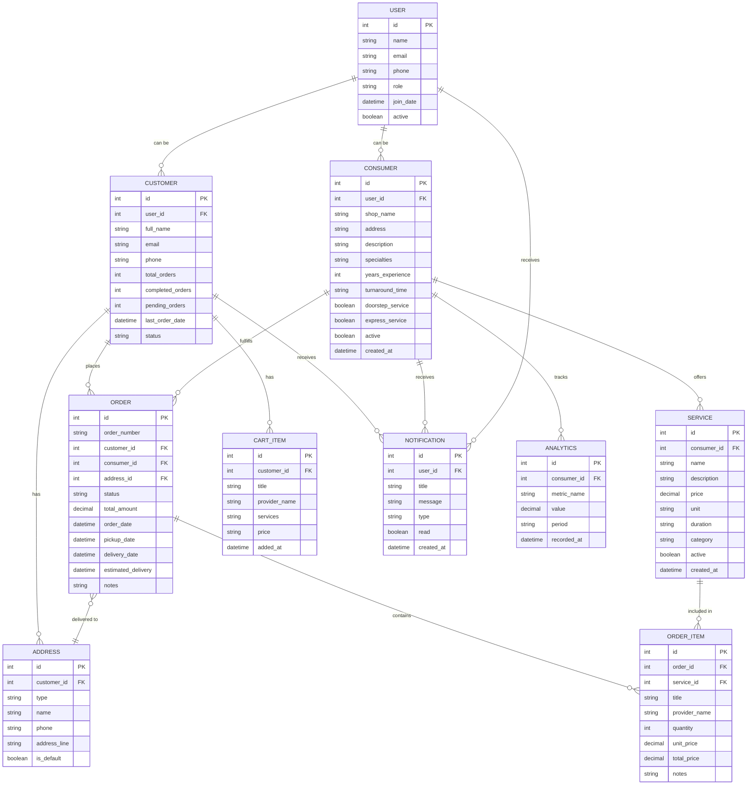

# LaundryMate App - Entity Relationship Diagram

## ER Diagram (Mermaid Format)

## Entity Descriptions

### Core Entities

**USER**
- Base entity for all app users
- Contains common authentication and profile data
- Role field determines if user is customer or consumer

**CUSTOMER** 
- Extends USER for customers who book laundry services
- Tracks order statistics and customer status
- Links to orders, addresses, and cart items

**CONSUMER**
- Extends USER for laundry service providers
- Contains shop details, services offered, and business info
- Links to services, orders they fulfill, and analytics

### Service & Order Management

**SERVICE**
- Laundry services offered by consumers
- Includes pricing, duration, category (Regular/Premium/Express)
- Can be active/inactive

**ORDER**
- Central entity for laundry bookings
- Links customer, consumer, delivery address
- Tracks status progression and dates

**ORDER_ITEM**
- Individual services within an order
- Links to specific services with quantities and pricing

**CART_ITEM**
- Temporary storage for services before checkout
- Belongs to specific customer

### Supporting Entities

**ADDRESS**
- Customer delivery addresses
- Supports multiple addresses per customer (Home, Office, etc.)

**NOTIFICATION**
- System notifications for both customers and consumers
- Supports different notification types

**ANALYTICS**
- Business metrics tracking for consumers
- Stores various KPIs and performance data

## Key Relationships

1. **User Inheritance**: USER entity is extended by CUSTOMER and CONSUMER
2. **Order Flow**: CUSTOMER places ORDER → contains ORDER_ITEM → references SERVICE
3. **Service Management**: CONSUMER offers multiple SERVICE entities
4. **Address Management**: CUSTOMER has multiple ADDRESS options
5. **Cart System**: CUSTOMER accumulates CART_ITEM before creating ORDER
6. **Notifications**: Both user types receive NOTIFICATION entities
7. **Analytics**: CONSUMER tracks business ANALYTICS

## Data Storage Notes

- Currently using in-memory storage (List<Map<String, dynamic>>)
- No persistent database implementation detected
- Uses singleton managers (CartManager, OrderManager) for state management
- SharedPreferences used for simple key-value storage
